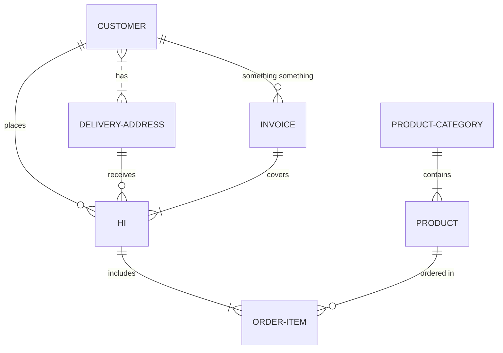

```json
"test": bla_bla"test": bla_bla"test": bla_bla"test": bla_bla
"test": bla_bla
```

[Verify me on DB](verify-me-on-db.oJPTP.pl.sw.md)

<br/>

<!--MERMAID {width:100}-->

<!--MCONTENT {content: "erDiagram<br/>\nCUSTOMER }|..|{ DELIVERY-ADDRESS : has<br/>\nCUSTOMER ||--o{ HI : places<br/>\nCUSTOMER ||--o{ INVOICE : \"something something\"<br/>\nDELIVERY-ADDRESS ||--o{ HI : receives<br/>\nINVOICE ||--|{ HI : covers<br/>\nHI ||--|{ ORDER-ITEM : includes<br/>\nPRODUCT-CATEGORY ||--|{ PRODUCT : contains<br/>\nPRODUCT ||--o{ ORDER-ITEM : \"ordered in\"<br/>"} --->

<br/>

efew `👤 Test 2[1jmWw1]` `👤 Test 2[1jmWw1]`
<!-- NOTE-swimm-snippet: the lines below link your snippet to Swimm -->
### 📄 src/manifest.json
<!-- collapsed -->

```json
4        "homepage_url": "http://localhost:8080/",
5        "description": "A Vue Browser Extension",
6        "default_locale": "en",
7        "permissions": [
8              "contextMenus",
9          "<all_urls>",
10         "*://*/*"
```

<br/>

> testsetestsetestestnjk. ehrfkjr

<br/>

dwdwqd

ef `📄 .gitignore`

efef fenkjw fe /
<!-- NOTE-swimm-snippet: the lines below link your snippet to Swimm -->
### 📄 package.json
```json
8        "scripts": {
9          "serve": "vue-cli-service build --mode development --watch",
10         "build": "vue-cli-service build",
11         "lint": "vue-cli-service lint"
12       },
13       "dependencies": {
14         "core-js": "^3.6.4",
15         "qs": "^6.9.3",
16         "vue": "^2.6.11",
17         "vuex": "^3.2.0"
18       },
19       "devDependencies": {
```

<br/>

<br/>

<br/>

This file was generated by Swimm. [Click here to view it in the app](vscode-webview://1n104adest2jc5hvhuvajsrt7l7d53iqv19tg94neupuvgpolhg9/repos/Z2l0aHViJTNBJTNBc3ItZXh0ZW5zaW9uJTNBJTNBZG91ZWs=/docs/d0wr6).
